# 从 Commit 历史读懂 VCampus

> 面向课程答辩、代码走查与后续维护的项目演进说明。本文不按目录机械罗列类，而是按照真实 Git 提交顺序，解释 VCampus 为什么会演化成现在的结构、每一阶段解决了什么问题，以及阅读代码时应该沿哪条链路继续。

## 1. 先看全局：项目最终长什么样

VCampus 是一个 JavaFX 客户端、Java Socket 服务端和 MySQL 数据库组成的虚拟校园系统。六个业务模块共用登录、主界面、消息协议、服务端路由和数据库连接设施。

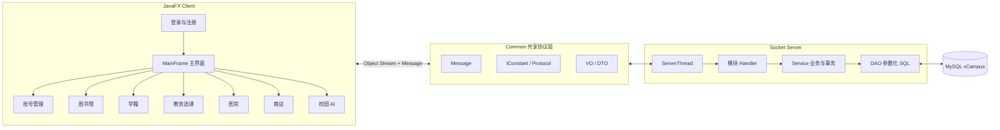

各模块在界面上彼此独立，在基础设施上共享同一条主干：

| 模块 | 核心职责 | 主要数据 |
|---|---|---|
| 用户管理 | 登录、注册、审核、角色与账号状态 | User |
| 图书馆 | 图书查询、借阅、归还和管理员维护 | Book、Borrow |
| 学籍 | 学生档案、班级与专业管理、跨模块学籍查看 | Student |
| 教务选课 | 课程、教学班、选退课、课表、排课、成绩 | Course、TeachingClass、Schedule、SelectCourse、CourseScore |
| 医院 | 挂号、叫号、处方、药品和库存 | Doctor、Appointment、Prescription |
| 商店 | 商品、购物车、订单、钱包和促销 | Goods、Purchase、Wallet |

## 2. 一张图看懂演进主线

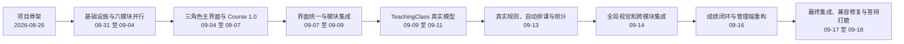

这条时间线背后有两个并行方向：

1. **横向集成**：六名成员分别开发模块，再通过 PR 和集成分支进入 `main`。
2. **纵向深化**：教务模块从简单 Course CRUD，逐步建立 TeachingClass、多段 Schedule、事务选课、CSP 自动排课和成绩审批完整领域模型。

## 3. 第一阶段：先搭能通信、能编译的地基

### `d95deac`：三模块骨架、Message 与 MySQL 连通

项目最初确定了 `Common / Server / Client` 三模块布局。这个提交的意义不只是“建文件夹”，而是提前确定了系统边界：

```text
Client 只能通过 Socket 请求业务
Server 负责规则、事务和数据库访问
Common 只承载双方都需要的协议与数据对象
```

因此后续任何模块都应遵循：

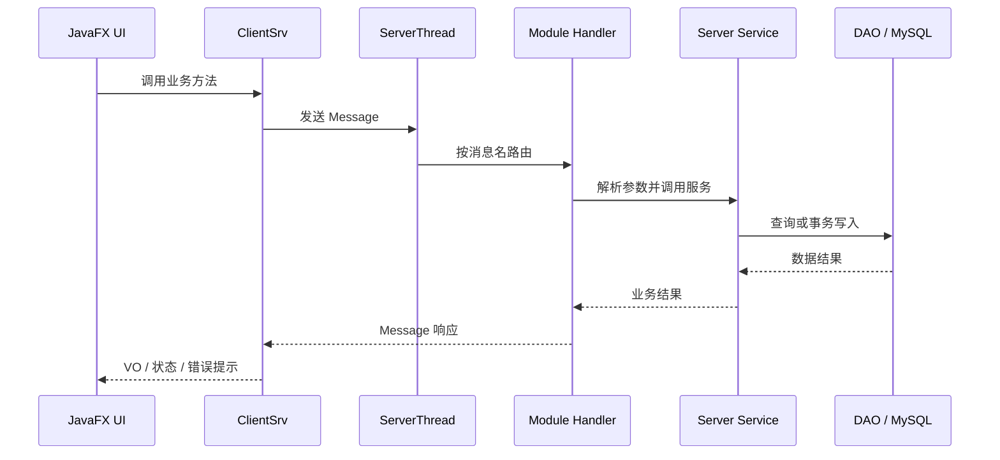

### `23f3489`、`02a85e8`、`15faa71`、`ac2a793`：规范与开发环境

这一组提交补入课程材料、排期、JavaFX 21.0.12 约定和共享构建设施。它们解决的是多人协作最早出现的问题：每个人机器上的 JDK、JavaFX 和启动方式不同，会造成“我的电脑能跑”的假象。

### `502eb67`：一键构建与启动

根目录形成四个正式入口：

```text
build.bat       编译 Common、Server、Client
run-server.bat  启动 Socket 服务端
run-client.bat  启动 JavaFX 客户端
start-all.bat   编译并启动两端
```

这一步把零散命令固化为可重复的交付流程，后来又通过 `1874a71` 统一 Windows 批处理文件的 CRLF 行尾，解决 `cmd.exe` 将残缺行识别成命令的问题。

## 4. 第二阶段：六个模块并行接入主干

从 9 月 2 日开始，项目通过合并分支和 Pull Request 逐步把图书馆、学籍、商店、医院、用户与教务接入统一外壳。

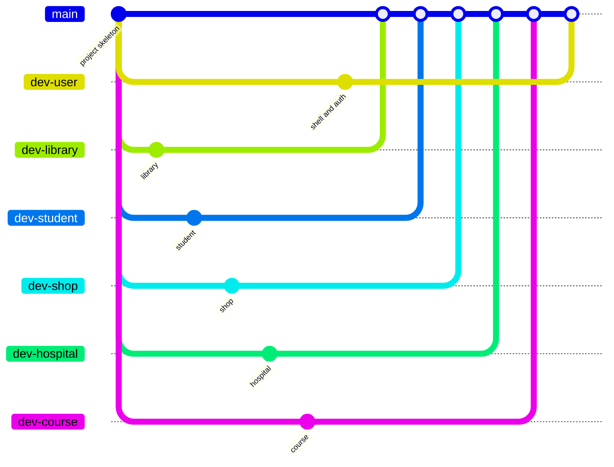

关键主线节点包括：

| Commit | 作用 |
|---|---|
| `2e0f205` | 首批用户与图书馆集成进入主线 |
| `c55d117` | 学籍、商店等模块继续集成 |
| `422419f` | 医院模块进入主线 |
| `6096edd` | 三角色登录与主界面角色可视化完成 |
| `37c10be` | Course 1.0 通过 PR 进入主线 |
| `6d3ae96` | 教务界面美化更新继续进入主线 |
| `06ec156`、`ae08c9b`、`5a7db43`、`8691c80` | 商店、图书馆、医院、学籍后续能力集中合入 |

这里最重要的工程经验是：**模块独立不等于复制一套基础设施**。最终采用一个 `MainFrame`、一个 `ServerThread` 和多个模块 Handler，既保留模块边界，也避免六套登录和六个服务端入口。

## 5. 第三阶段：Course 1.0 从数据库一路打通到 JavaFX

教务模块最初采用“按层推进”的提交方式，每个 commit 都让调用链向前延伸一层。

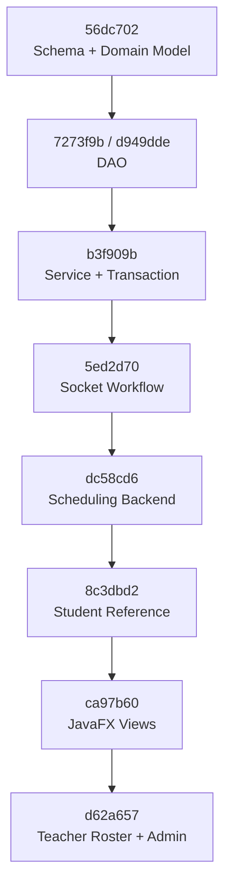

### 5.1 `56dc702`：先定义 Course 领域对象

先落地课程表、选课表和共享 VO，保证客户端和服务端对字段含义达成一致。此时的模型仍偏向 Course 1.0：一门课程直接携带教师、容量和排课信息，适合快速打通最小闭环。

### 5.2 `7273f9b`、`d949dde`：DAO 完整化

DAO 使用参数化 SQL 完成查询、插入、更新和删除。把 SQL 封装在服务端数据层后，UI 和 Socket Handler 都不需要知道表结构细节。

### 5.3 `b3f909b`：事务层成为规则中心

选课不是简单 `INSERT`。服务端需要在同一事务中检查学生、课程、重复选课和容量，并同步维护已选人数；退课则执行相反操作。失败时完整回滚，避免出现“有选课记录但人数没加”或“人数减少但记录还在”的半成功状态。

### 5.4 `5ed2d70`：Socket 链路闭环

客户端服务把方法调用转换成 `Message`，`ServerThread` 按消息名称分发到 Course Handler，Handler 再调用 Service。至此，即使没有 JavaFX 页面，教务业务也可以通过 Socket 端到端验证。

### 5.5 `dc58cd6` 到 `ca97b60`：排课、学生引用与三角色页面

- `dc58cd6` 增加排课后端；
- `8c3dbd2` 强化选课记录与学生的真实关联；
- `ca97b60` 加入学生、教师和管理员 JavaFX 页面；
- `d62a657` 补齐教师名单与课程管理；
- `d80cb7d`、`24fc73f`、`c897686` 完成学生工作区、教师/管理员界面和响应式课表打磨。

Course 1.0 到这里已经形成可演示闭环，但一个结构性问题仍然存在：**Course 既表示课程内容，又表示一次具体开班**。

## 6. 第四阶段：用 TeachingClass 修正领域模型

### `49f97c5`：最关键的领域重构

现实中“数据库原理”是一门课程，但可以同时开 01 班、02 班，由不同教师授课，容量和上课时间也不同。因此模型被拆成三层：

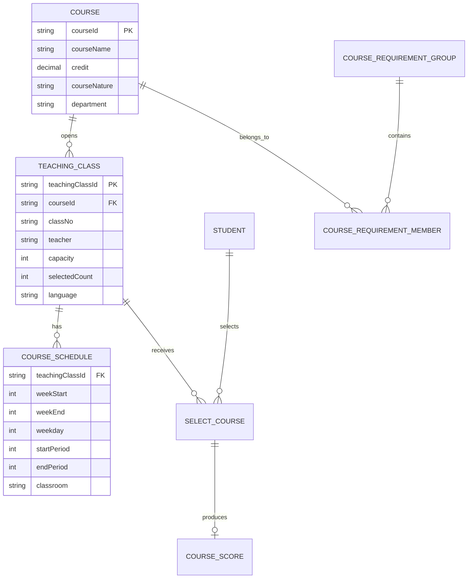

重构后的边界是：

- `Course`：课程本体，只描述名称、学分、性质和开课单位；
- `TeachingClass`：一次实际开班，描述教师、班号、语言、容量和已选人数；
- `CourseSchedule`：教学班的一段时间与教室安排，一个教学班可以拥有多段 Schedule；
- `SelectCourse`：学生选择的是教学班，同时保留课程引用以防同一课程重复选班。

`244b25f` 随后加入真实感计算机类课程数据，`d2bc41a` 用自动测试验证新模型，`1397ca3` 将迁移与使用方法固化为文档。

### 兼容策略

旧 Course 1.0 数据没有被粗暴删除。`tblCourse` 中旧教师、容量和人数列保留为兼容投影，新业务以 TeachingClass 为准。这使旧数据和旧页面可以渐进迁移，也减少多人协作时的破坏性变更。

## 7. 第五阶段：把“能选课”升级为“选课规则正确”

### `4029b1d`、`c8757fc`：时间冲突与无冲突种子

课程冲突不能只比较星期和起始节。两段排课只有在星期相同，且教学周区间、节次区间都相交时才冲突：

```text
max(a.weekStart, b.weekStart) <= min(a.weekEnd, b.weekEnd)
max(a.startPeriod, b.startPeriod) <= min(a.endPeriod, b.endPeriod)
```

`4029b1d` 将这条规则落到服务端，`c8757fc` 修正演示数据，使初始化后的选课组合本身不带冲突。

### `2687010`：真实选课规则

一次选课请求会经过完整事务：

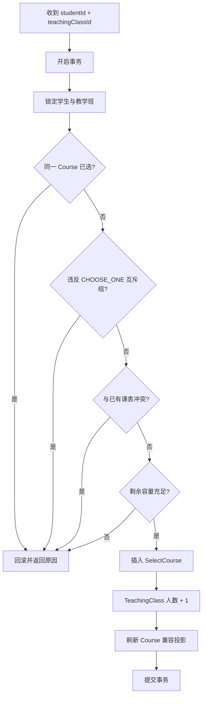

数据库唯一约束与服务端行锁构成双重防线。`298c4d3` 进一步用 100 个隔离测试学生竞争容量 10 的教学班：成功 10、拒绝 90、超卖 0、人数漂移 0。

## 8. 第六阶段：自动排课从随机生成变成约束求解

### `556be29`：Backtracking + MRV

自动排课把每个尚未排课的 TeachingClass 看作变量，把可用的“时间模式 × 教室”看作候选域，并检查教师、教室和教学班自身冲突。

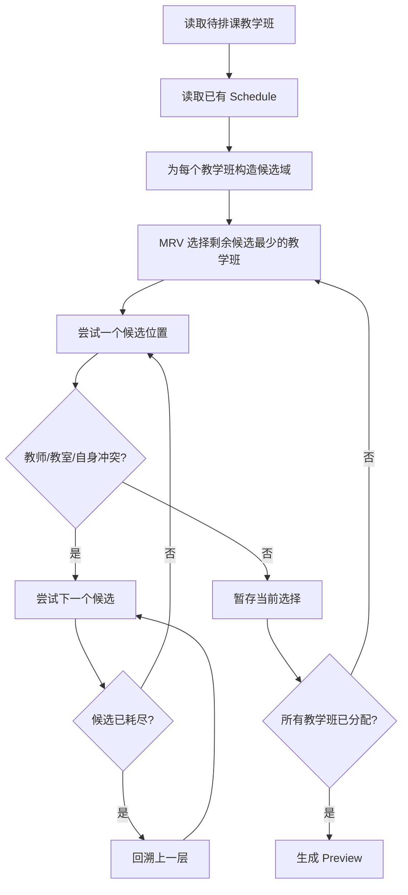

Preview 与 Apply 被刻意分开：

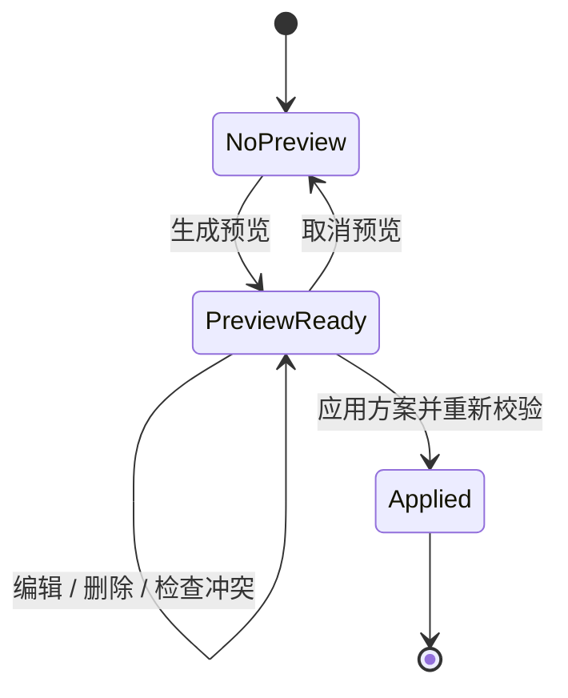

Preview 只存在于客户端，不修改数据库；Apply 在单一事务中重新检查后批量写入，任何一条失败都会回滚。这避免管理员查看方案时污染正式课表，也能拒绝已经过期的预览。

后续提交继续补强：

| Commit | 改进 |
|---|---|
| `aa313c8` | 一键加载带 `DEMO_` 前缀且幂等的自动排课演示数据 |
| `cb9f5e2` | 课程名、演示教师、教室编号和时间分布更符合展示场景 |
| `cd3575b` | 为预览增加一键冲突校验 |
| `e06a650` | 自动排课与管理页面采用可直接编辑的主从布局 |
| `4b11e54`、`d16f6d3` | 恢复操作闭环并保证详情表单完整可访问 |

## 9. 第七阶段：统计、导出与成绩审批形成三角色闭环

### `a19b300`：Dashboard 与 CSV

管理员 Dashboard 的课程数、教学班数、选课人数、容量利用率、热门班级和剩余名额均来自实时 SQL 聚合。教师名单与管理员统计使用 UTF-8 BOM CSV，保证中文 Windows Excel 可直接打开。

### `f2d18a7`：成绩业务不是一个分数字段

成绩需要跨越教师、管理员和学生三个角色，因此采用状态机控制可见性：

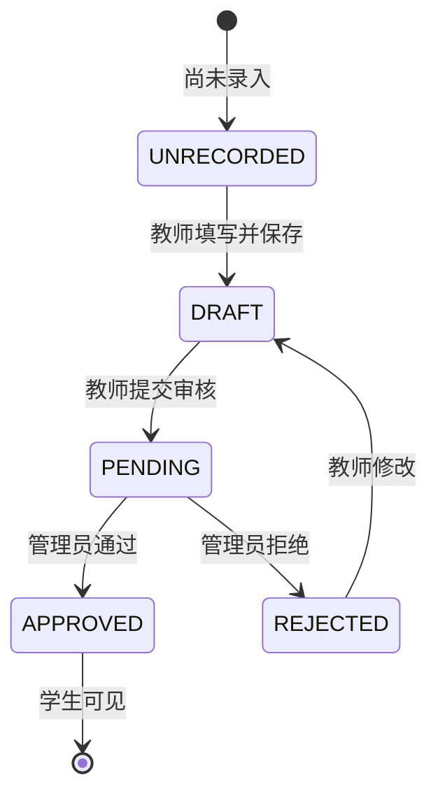

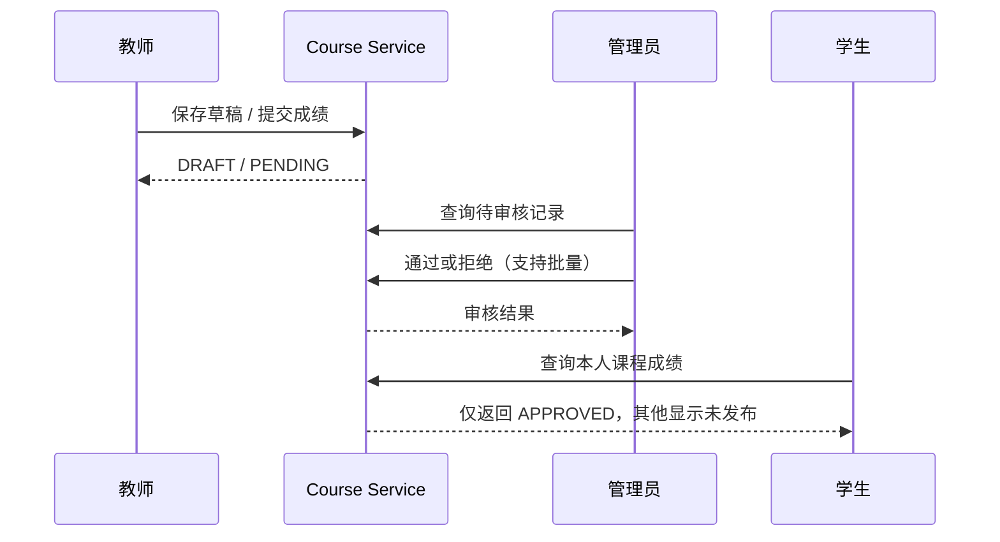

这比“教师输入后学生立即看到”多了一层发布控制，也保留了拒绝后修改再提交的路径。

## 10. 第八阶段：视觉统一与跨模块集成

`b64c42d` 将主界面和教务模块统一为绿色校园主题；商店、医院和学籍随后也逐步采用卡片、药丸页签、统一表格和滚动条样式。视觉统一并不只改颜色，还包括：

- 管理页面由“表格每行编辑按钮 + 弹窗”改为左侧列表、右侧详情的主从布局；
- 学生课程大厅直接显示可选、已选、满员、时间冲突和互斥原因；
- 教师工作台同时展示本人教学班、统计、学生名单和导出入口；
- 自动排课 Preview 可以选中后直接编辑与移除；
- 成绩审核支持逐条与批量操作。

9 月 14 日的集成分支通过 `34ee8a5` 进入主线；9 月 17 日的第二轮大集成通过 `90f451b` 进入主线。`ce18c9b` 修复了合并后教师成绩页仍调用旧鉴权签名的问题，说明集成验收必须覆盖编译、Socket 请求与真实 GUI，而不能只看提交是否成功。

9 月 18 日，学籍管理、商店价格快照、跨机器服务器地址等更新通过 `958d8d9`、`3f03e04` 和 `4bc2a1e` 继续进入 `main`，形成当前团队版本。

## 11. 如何按 Commit 顺序阅读代码

如果想重新体验项目从零长出来的过程，建议按下面顺序查看。每一步都先看 commit 的文件列表，再打开核心实现。

```bash
git show --stat <commit>
git show --name-status <commit>
git show <commit> -- <path>
```

| 阅读阶段 | Commit | 优先阅读位置 | 观察重点 |
|---|---|---|---|
| 项目地基 | `d95deac` | `Common/`、`Server/`、`Client/` | 三模块边界与 Message |
| 构建启动 | `502eb67` | 根目录 `*.bat` | 编译 classpath、JavaFX module path |
| Course 模型 | `56dc702` | `Common/.../vo`、`sql/course` | Course 1.0 的数据结构 |
| 数据访问 | `7273f9b`、`d949dde` | `Server/.../dao` | 参数化 SQL 与映射 |
| 事务服务 | `b3f909b` | `CourseServerSrv` | 规则检查与回滚 |
| Socket | `5ed2d70` | `CourseClientSrv`、`CourseHandler`、`ServerThread` | 请求如何跨进程 |
| JavaFX | `ca97b60` | `Client/.../view/course` | 三角色页面如何消费 Service |
| 真实模型 | `49f97c5` | TeachingClass、Schedule、迁移 SQL | Course 与开班分离 |
| 冲突规则 | `4029b1d`、`2687010` | Course Service 与规则组 DAO | 时间、容量和互斥约束 |
| 自动排课 | `556be29` | `CourseAutoScheduler` | MRV、候选域和回溯 |
| 统计导出 | `a19b300` | Dashboard DAO、CSV Exporter | SQL 聚合与文件编码 |
| 并发测试 | `298c4d3` | Course benchmark | 行锁与唯一约束效果 |
| 成绩闭环 | `f2d18a7` | CourseScore VO/DAO/Service/Pane | 状态机与角色可见性 |
| 管理体验 | `e06a650`、`4b11e54`、`d16f6d3` | 管理端 Pane | 主从布局与操作闭环 |
| 集成修复 | `ce18c9b` | TeacherScorePane 与客户端接口 | 跨模块签名变化 |

## 12. 从页面动作反向定位代码

### 学生点击“选课”

```text
CourseHallPane
  -> ICourseClientSrv / CourseClientSrv
  -> Message(courseSelect)
  -> ServerThread
  -> CourseHandler
  -> CourseServerSrv.selectCourse
  -> TeachingClassDAO / SelectCourseDAO / ScheduleDAO
  -> MySQL transaction
```

### 教师提交成绩

```text
TeacherScorePane
  -> CourseClientSrv
  -> CourseHandler
  -> CourseServerSrv
  -> CourseScoreDAO
  -> status = PENDING
```

### 管理员生成自动排课预览

```text
AutoSchedulePane
  -> AutoScheduleRequest
  -> CourseServerSrv.previewAutoSchedule
  -> CourseAutoScheduler.solve
  -> AutoSchedulePlan（不落库）
  -> 页面编辑 / 删除 / 校验
  -> applyAutoSchedule
  -> 单事务写入 CourseSchedule
```

## 13. 关键设计取舍

### 为什么 Client 不直接访问数据库

如果 JavaFX 直接执行 SQL，容量、权限、冲突和成绩可见性就会散落在多个页面，任何客户端都能绕过规则。统一经过 Service 后，GUI 只负责展示和发起意图，服务端才是业务规则的最终裁判。

### 为什么每次请求使用短连接

课程项目中的请求粒度较小，短连接实现简单，失败边界清晰，并且便于给连接和读取设置超时。代价是每次请求都需要建立 Socket；若未来请求量显著增加，可以演进为连接池或长连接协议。

### 为什么保留迁移与 Seed

Schema 只描述“全新数据库”，Migration 负责“已有数据库如何升级”，Seed 负责“如何得到可重复演示的数据”。把三者混在一个脚本里会导致升级时误删真实数据，因此项目将教务迁移、Reality 数据和答辩 Demo 数据分开，并尽量保持幂等。

### 为什么 Preview 不能直接写库

自动排课需要让管理员先判断方案是否合理。预览阶段落库会让取消操作变成复杂的反向恢复；内存 Preview 加 Apply 事务能提供明确的确认边界。

## 14. 当前版本地图

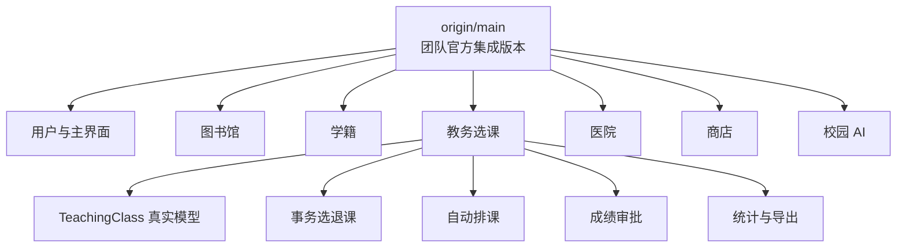

截至本文整理时，主线已经包含：六业务模块、三角色主界面、教务真实模型、自动排课、成绩审批、医院处方与药品、商店购物车与订单、学籍角色化管理，以及相应的迁移、演示数据和测试。

## 15. 最后用一句话概括每个阶段

1. **先让系统有统一骨架。**
2. **再让六个模块能在同一主界面和服务端中协作。**
3. **按 DAO、Service、Socket、JavaFX 的顺序打通教务闭环。**
4. **用 TeachingClass 修正真实业务模型。**
5. **用事务、锁和约束保证选课正确。**
6. **用 Backtracking + MRV 将自动排课建模为约束满足问题。**
7. **用状态机完成教师录入、管理员审核、学生查看的成绩闭环。**
8. **通过集成分支、自动测试和 GUI smoke 把各模块交付为一个系统。**

继续深入教务模块时，可结合 [Course Reality Track 最终交付说明](course/README.md) 查看数据库初始化、Socket API、测试入口和演示账号。
